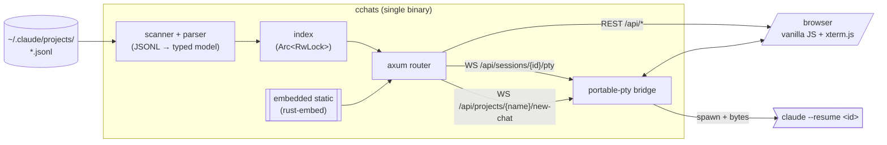
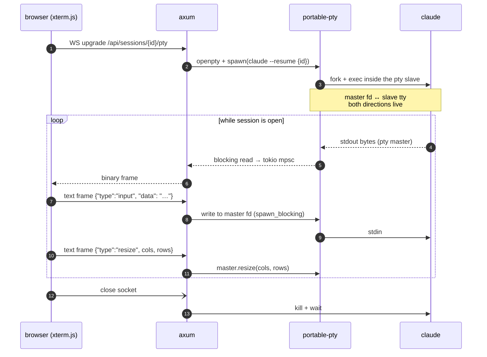

# constellation

A local web UI to browse and resume every Claude Code chat across all your projects.

Claude Code stores conversation history per working directory in
`~/.claude/projects/<sanitized-cwd>/<session-uuid>.jsonl`, which means
`claude --resume` only shows sessions from the directory you happen to be in.
Constellation reads all of them, groups them by project, and lets you preview,
fork or resume any chat from one place — with an embedded terminal so resume
happens right in the browser tab.

## install

From source (requires Rust 1.85+):

```sh
git clone https://github.com/intjiraya/constellation
cd constellation
cargo install --path .
```

## use

```sh
cchats                 # serves on http://127.0.0.1:6767 and opens the browser
cchats --port 9090
cchats --no-open
cchats --root /path/to/claude/projects
```

## what it does

- **scans** `~/.claude/projects/*/` for `.jsonl` session files
- **parses** each session into a normalized model (turns, blocks, tool calls,
  timestamps, token usage)
- **serves** a local web UI showing every chat across every project with
  search, previews, token statistics and prompt-cache hit ratios
- **resumes** any chat by spawning `claude --resume <id>` inside a PTY,
  bridged into the browser through an `xterm.js` terminal

Nothing leaves your machine, nothing is uploaded.

## architecture



Static assets (HTML / CSS / JS / SVG logo) are embedded into the release binary
via `rust-embed`, so distribution is a single ~2.7 MiB stripped binary with no
runtime dependencies beyond `libc`.

### resume flow

When you click **▶ resume** on a chat, the browser opens a WebSocket to the
binary, which forks a real `claude` process inside a PTY and proxies bytes both
ways. xterm.js renders the terminal in-page.



## License

Licensed under either of

 * Apache License, Version 2.0
   ([LICENSE-APACHE](LICENSE-APACHE) or http://www.apache.org/licenses/LICENSE-2.0)
 * MIT license
   ([LICENSE-MIT](LICENSE-MIT) or http://opensource.org/licenses/MIT)

at your option.

## Contribution

Unless you explicitly state otherwise, any contribution intentionally submitted
for inclusion in the work by you, as defined in the Apache-2.0 license, shall be
dual licensed as above, without any additional terms or conditions.
