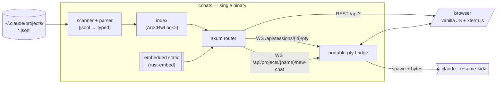
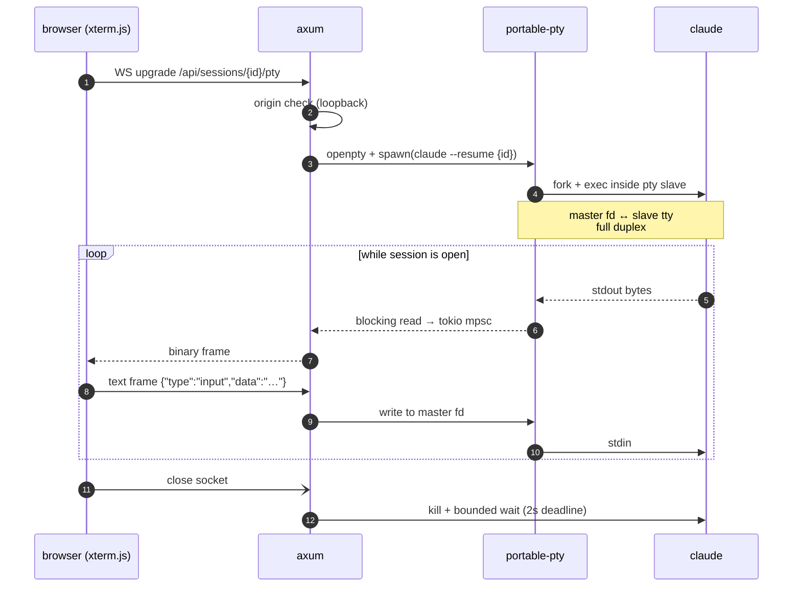

<div align="center">

<br>

```
                       _       _ _       _   _
  ___ ___  _ __  ___| |_ ___| | | __ _| |_(_) ___  _ __
 / __/ _ \| '_ \/ __| __/ _ \ | |/ _` | __| |/ _ \| '_ \
| (_| (_) | | | \__ \ ||  __/ | | (_| | |_| | (_) | | | |
 \___\___/|_| |_|___/\__\___|_|_|\__,_|\__|_|\___/|_| |_|
```

#### every claude code chat, in one place — fast, local, single binary

<br>

[](#license)
[](https://www.rust-lang.org)
[](#)
[](#)
[](#)

<br>

</div>

> `claude --resume` only shows chats from the directory you're in.
> **constellation** reads every chat from every project, in one place,
> with a real PTY-resume right in the browser.

<br>

<div align="center">

```
┌─────────────────────────────────────────────────────────────────┐
│  ●  constellation       ●  352 indexed · 3.4M tok    ⌕ search   │
│ ─────────────────────────────────────────────────────────────── │
│                │                          │                     │
│  PROJECTS   29 │  ~/code/personal  ·  8   │  refactor auth      │
│  ────────────  │  ──────────────────────  │  ─────────────      │
│  ▸ ~/code/…12  │  ▸ refactor auth         │  user · 14:48       │
│  ▸ ~/srv  · 8  │    351 msgs · 2h · opus  │  pulled out…        │
│  ▸ ~/…/y  ·17  │  ▸ migrate to prisma     │                     │
│  ▸ ~/…/i  ·23  │     89 msgs · 5h · opus  │  asst · 14:48       │
│                │  ▸ tokens audit          │  here's a plan…     │
│                │     42 msgs · just now   │                     │
│                │                          │  ▶ resume   ⑂ fork  │
└─────────────────────────────────────────────────────────────────┘
```

</div>

<br>

## · install

```sh
git clone https://github.com/intjiraya/constellation
cd constellation
cargo install --path .
```

<details>
<summary><b>· future install paths</b> · pacman · brew · scoop · apt</summary>

```sh
# arch (AUR) — coming soon
yay -S constellation

# macos / linux (homebrew) — coming soon
brew install intjiraya/tap/constellation

# windows (scoop) — coming soon
scoop install constellation

# debian / ubuntu (.deb) — coming soon
curl -fsSL https://github.com/intjiraya/constellation/releases/latest/download/constellation_amd64.deb \
  | sudo dpkg -i
```

</details>

<br>

## · use

```sh
cchats                        #  http://127.0.0.1:6767  + opens browser
cchats --port 9090
cchats --no-open
cchats --root /custom/path    #  override ~/.claude/projects
```

<br>

## · features

| feature                           | what it does                                                                              |
| :-------------------------------- | :---------------------------------------------------------------------------------------- |
| `every chat in one place`         | reads every `~/.claude/projects/<sanitized>/*.jsonl`, groups by project, sorts by recency |
| `live resume in the browser`      | click → spawns `claude --resume <id>` inside a PTY, bridged through WebSocket → xterm.js  |
| `fork without scarring`           | one-click `--fork-session` from any chat, original untouched                              |
| `new chat from the rail`          | start a fresh `claude` session in any indexed project's cwd                               |
| `token accounting`                | input / cache-create / cache-read / output buckets, per chat, per project, all-up         |
| `single 3.2 MiB binary`           | rust, no runtime, no node, no python — `rust-embed` ships every asset inside              |
| `loopback-only, origin-checked`   | binds 127.0.0.1, rejects non-loopback `Origin`, strict CSP, vendored CDN scripts          |

<br>

## · architecture



<details>
<summary><b>· resume flow</b> — what happens when you press ▶ resume</summary>



</details>

<br>

## · how fast

Measured on real data (152 sessions, 234 MiB JSONL).
Same machine, same workload, against the prototype Python backend.

| metric              |   python |          rust | delta  |
| :------------------ | -------: | ------------: | :----- |
| cold start          | 1 360 ms |    **5.6 ms** | −99.6% |
| index ready (152)   | 1 366 ms |    **447 ms** | −67.3% |
| RSS idle            |   64 MiB |  **18.6 MiB** | −71%   |
| `/api/stats` p50    |  0.42 ms |   **0.08 ms** | −81%   |
| `/api/projects` p50 |  0.80 ms |   **0.14 ms** | −83%   |
| big session parse   |    61 ms |     **27 ms** | −56%   |
| reindex 234 MiB     | 1 060 ms |    **430 ms** | −59%   |

> **Distribution:** Python needs ≥ 3.10 + a venv. Rust ships as **a single
> 2.7–3.2 MiB binary** with zero runtime dependencies beyond `libc`.

<br>

## · security

The frontend lives in the same threat model as `~/.claude/projects` itself,
but everything that crosses a boundary is locked down.

| control                     | what it gives you                                                               |
| :-------------------------- | :------------------------------------------------------------------------------ |
| `WebSocket Origin check`    | rejects any non-loopback origin · same-machine pages can't attach to a live PTY |
| `child env allowlist`       | `TERM` / `PATH` / `HOME` only · no `ANTHROPIC_API_KEY` / AWS / GH tokens leak   |
| `Content-Security-Policy`   | `default-src 'self'` · `frame-ancestors 'none'` · all scripts vendored          |
| `mandatory DOMPurify`       | every `innerHTML` sanitised · text-only fallback when DP is missing             |
| `canonical cwd guard`       | PTY spawn refuses paths outside `$HOME`                                         |
| `host validation`           | loud `stderr` warning on `--host` outside loopback                              |

A full third-party audit on the codebase produced **3 P0 / 33 P1 / 13 P2** findings —
**all P0 and the vast majority of P1/P2 are fixed in `c9d5fbe`**.

<br>

## · status

```
✓  parser, scanner, index           — 56 unit tests, TDD
✓  REST API + WS bridge             — 15 integration tests
✓  vendored frontend, embed binary  — 0 external script deps
✓  ConPTY support (Windows)         — cross-compiles to win-gnu
~  packaging (AUR / brew / scoop)   — next up
○  CI matrix (linux × macos × win)  — open
○  custom themes via :root vars     — open
○  inline incremental search        — open
```

<br>

## · License

Licensed under either of

 * Apache License, Version 2.0
   ([LICENSE-APACHE](LICENSE-APACHE) or http://www.apache.org/licenses/LICENSE-2.0)
 * MIT license
   ([LICENSE-MIT](LICENSE-MIT) or http://opensource.org/licenses/MIT)

at your option.

## · Contribution

Unless you explicitly state otherwise, any contribution intentionally submitted
for inclusion in the work by you, as defined in the Apache-2.0 license, shall be
dual licensed as above, without any additional terms or conditions.

<br>
<div align="center">

`built in rust · vendored to the bone · loopback-only by default`

</div>
